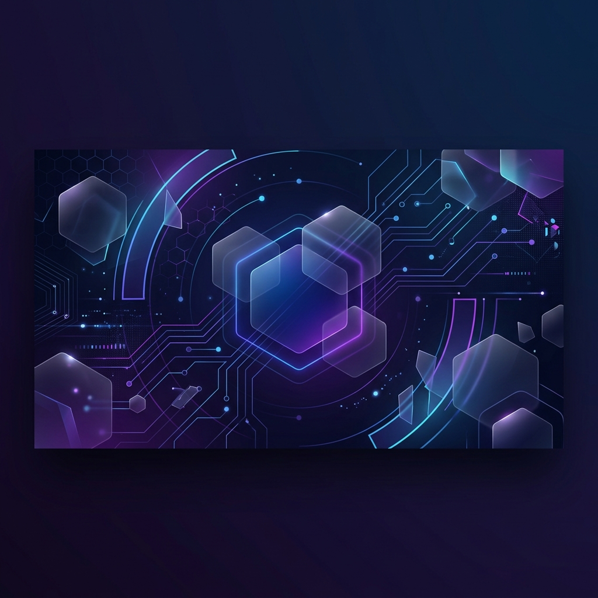

<!-- HEADER BANNER -->

 

# Hi there, I'm Naffee 👋
### Fullstack Developer | Architecting Digital Experiences

  
  
  

---

### 🚀 About Me
- 🔭 I’m currently working on **scalable API architectures and fintech solutions**.
- 🌱 I’m currently learning **Advanced System Design and Cloud-Native Technologies**.
- 💬 Ask me about **React, Node.js, and building robust backend services**.
- ⚡ Fun fact: **I believe clean code is a form of art.**

---

### 🛠️ Tech Stack

  

---

### 📊 GitHub Analytics

  

  
  

  
  

  

---

### 🤝 Connect with Me

  
  

 

---

  <i>"Code is like humor. When you have to explain it, it’s bad."</i>

